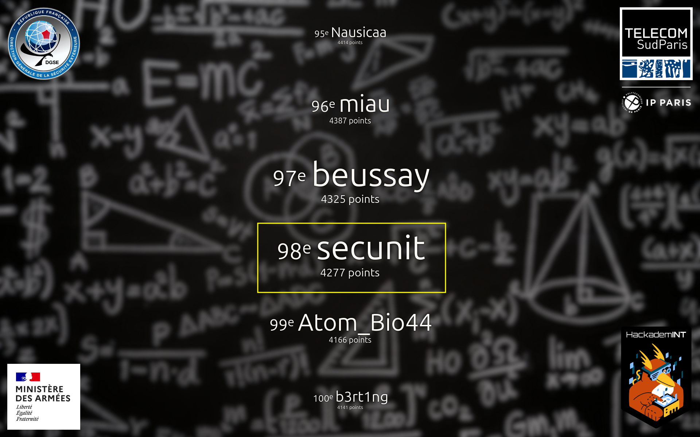

+++
date = '2026-08-20T08:53:19+02:00'
draft = true
title = '404CTF2026'

[menus.main]
  name = "404CTF2026"
  weight = 30
  parent = "Compétitions"
+++

#### 404CTF c'est quoi ?

L'évenement 404CTF est une compétition organisé par la DGSE (Direction Général de la Sécurité Exterieur). La compétitions se déroule sur 3 semaines.

C'est une compétition de type "jeopardy", ce qui signifie qu'il y plein de catégories différentes (crypto, pwn, réaliste, ...)

#### Résultat

404CTF propose un classement individuel. J'ai fini 98ème sur environ 2300 (2000 si on ne compte que ce qui ont des points). C'est un classement dont je suis assez content même si j'aurais pu clairement récupérer d'autres points sur la catégorie réaliste (ma catégorie préférée).

