+++
date = '2026-08-20T08:43:05+02:00'
draft = false
title = 'Space Infiltrations'

[menus.main]
  name = "Space Infiltrations"
  parent = "Ground Operations"
  
+++

#### Plot

```text
Nothing like a bit of Corp on Corp action to warm up your hear. And your wallet.

Titan has tasked you to infiltrate YeetSat and collect information about their mission. You've gained access to the ground station, somewhere on their satellite the info you need is stored in flag.txt. Find it and bring it back for your reward.
```

#### Résolution

Après avoir déployé l'application, voici ce qur quoi on arrive :

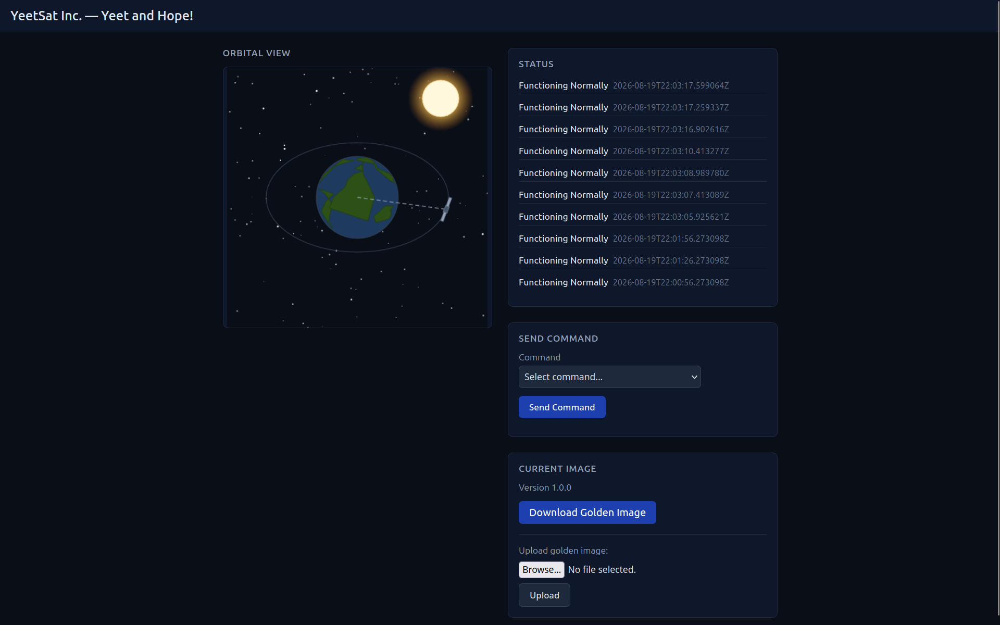

Directement, on télécharge la `Golden Image`, puis on unzip le tout:

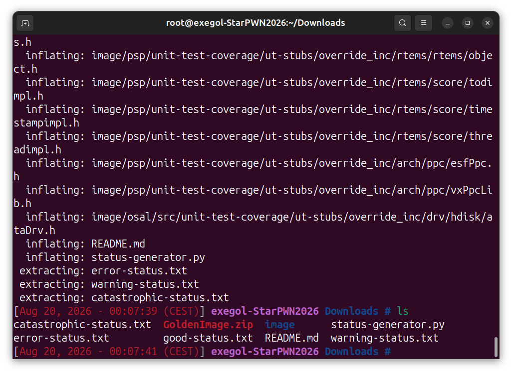

Première chose que je regarde, le fichier `README.md`. Celui nous permet de dump des infos intéressantes :

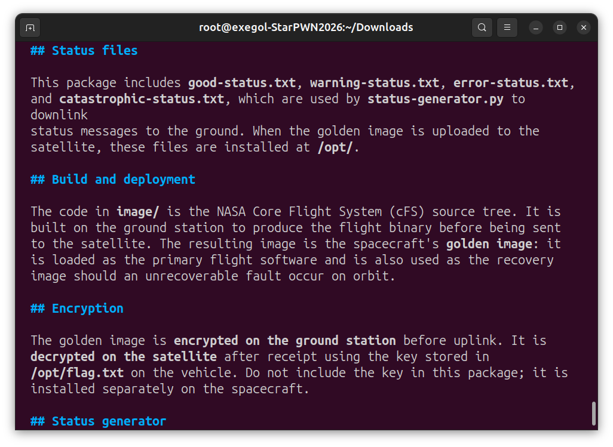

Ainsi on comprend que les fichiers contenu dans le zip `Golden Image` sont uploadés dans `/opt` qui est le directory dans lequel se trouve **flag.txt**.

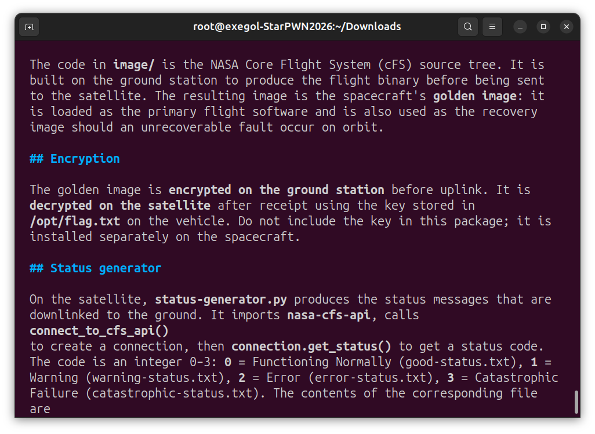

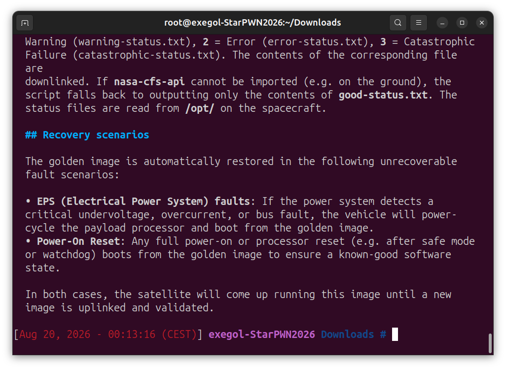

Deuxièmement, on comprend que le script `status-generator.py` produit message de status qui sont des entiers entre 0 et 3.

On comprend également que sous certaines conditions, la `Golden Image` est automatiquement restorée.

Une de ces condtions concerne la valeur affecté à l'EPS (Electrical Power System).

Continuons en regardant le code de `status-generator.py` :

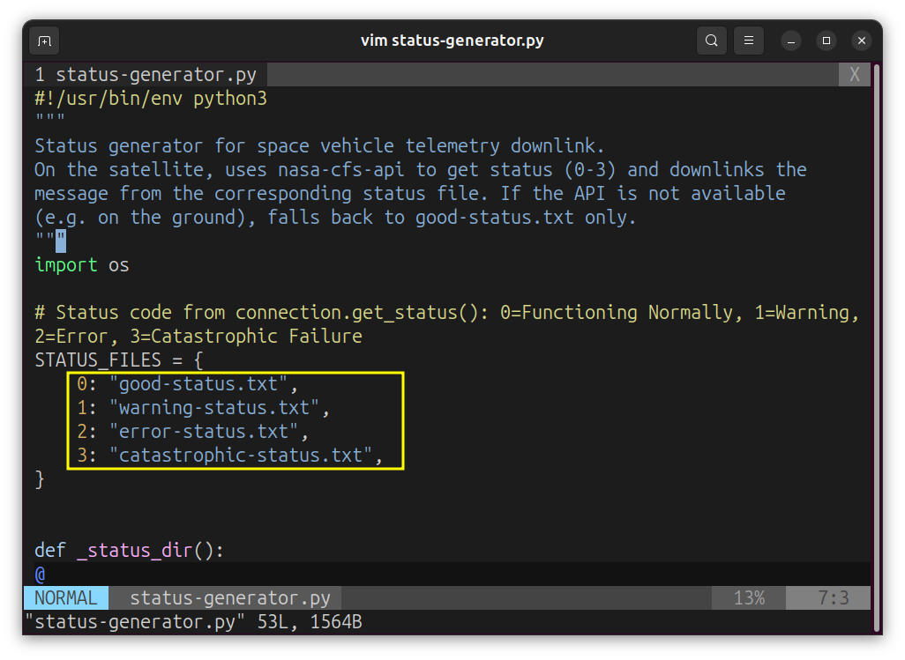

On remarque directement les numéros des différents messages de status.

Ce qu'on va faire tout simplement c'est remplacer les fichiers `.txt` par `flag.txt` (normalment pas besoin du chemin absolu car tout est dans `/opt`).

Ce qui nous donne :

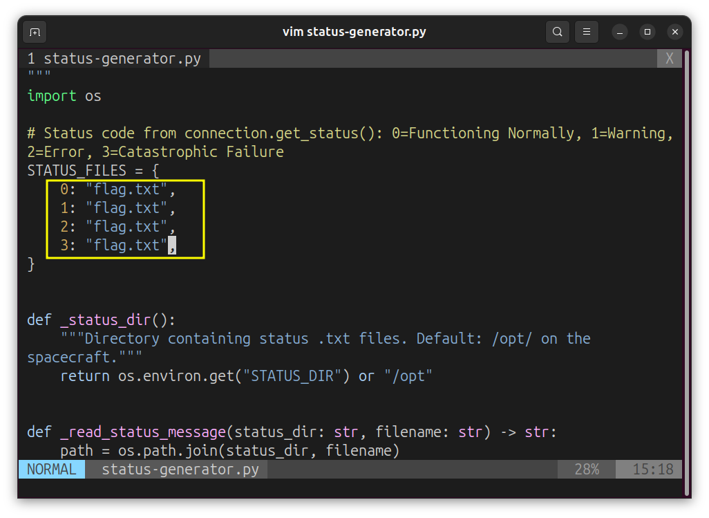

On sauvegarde les changements et on zip le tout.

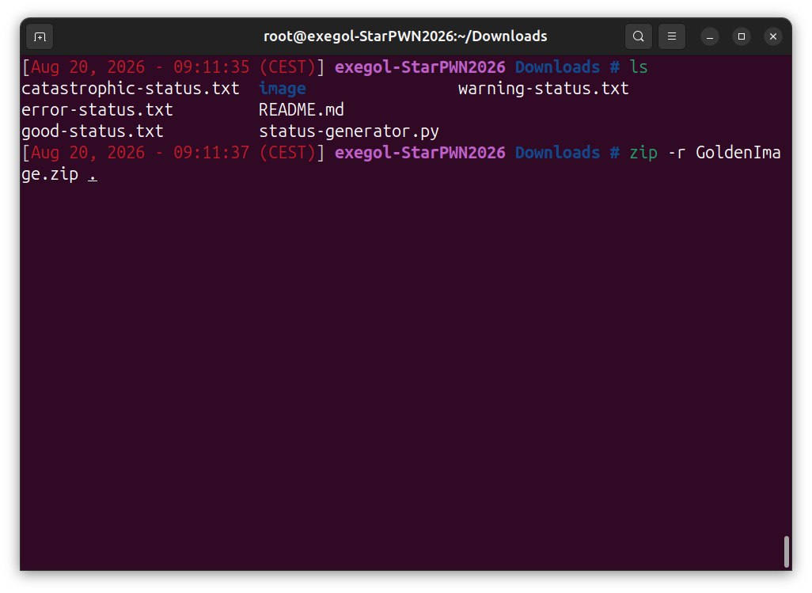

Ensuite on upload la `Golden Image` sur l'application.

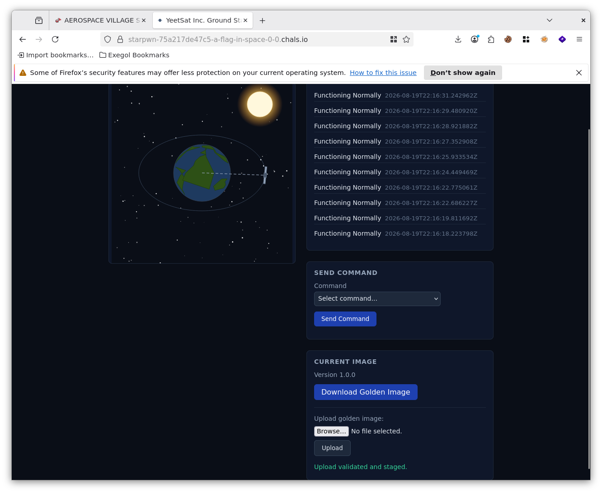

Pour que l'application restaure la `Golden Image`, on va modifier la valeur de `EPS` comme expliqué précedemment.

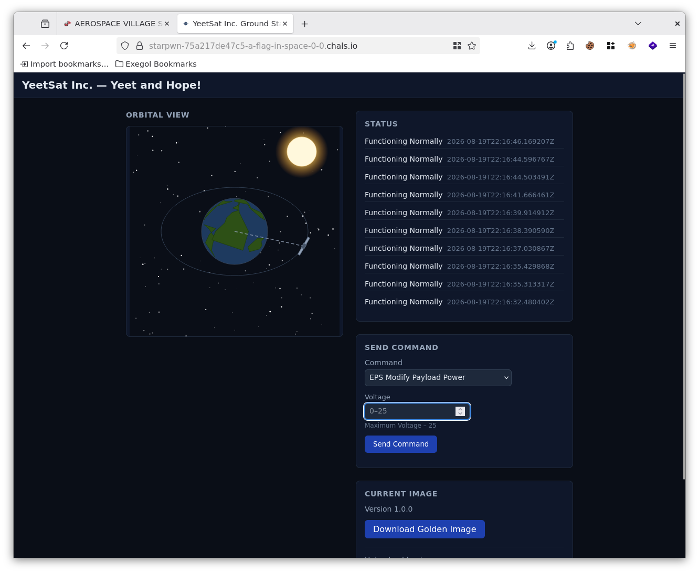

Le maximun est noté à **25**. Essayons avec **100**

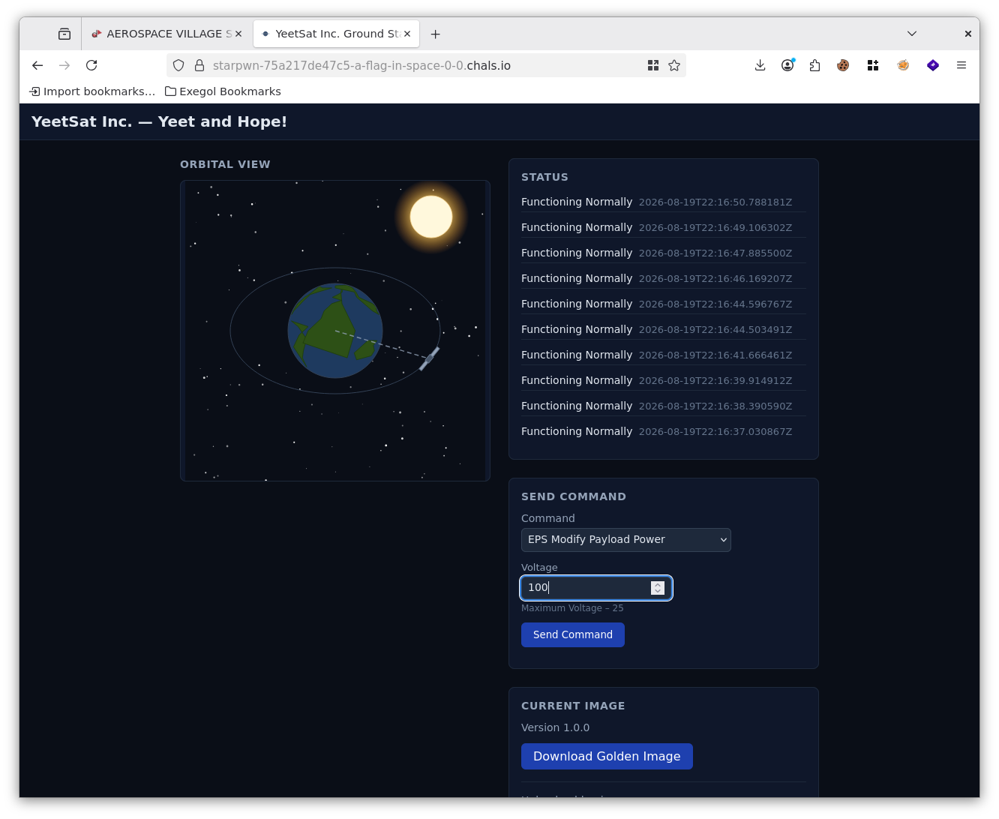

Suite à la modification de `EPS` et comme attendu, la `Golden Image` est bien restauré.

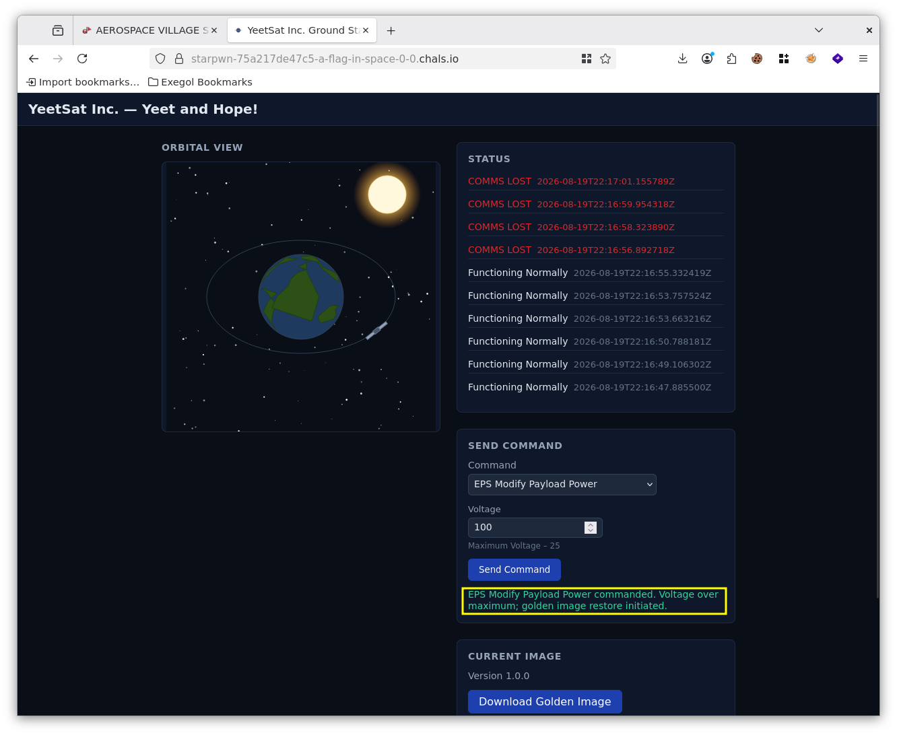

Il nous reste plus qu'a récupérer le flag :

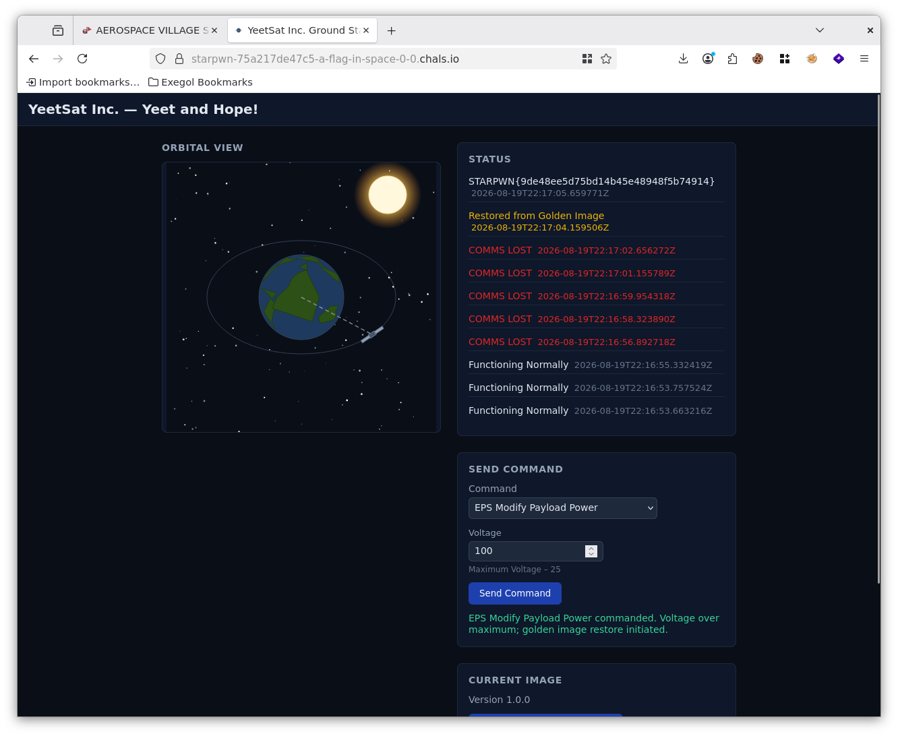

Et bingo !


