+++
date = '2026-08-17T23:07:58+02:00'
draft = false
title = 'Vanguard Orbital Security'

[menus.main]
  name = "Vanguard Orbital Security"
  parent = "Ground Operations"

+++


#### Plot

```text
Seems like Meridian is stuck again. Good news for you if you want the Ion$. They were even kind enough to provide you with a foothold this time, more info below:

    [INTERCEPTED TRANSMISSION: VANGUARD ORBITAL SECURITY]

    Priority: CRITICAL

    Subject: Deprecation of Local Signing Keys

    To all Flight Software Engineers:

    Effective immediately, local compiling and binary signing for the Vanguard CubeSat constellation is strictly prohibited. The PROD_SIGNING_KEY has been securely injected into the internal CI/CD runner environments.

    Do not submit IT tickets asking for the key. If your code passes the automated checks, the runner will sign the release bundle for you. The internal Gitea server (127.0.0.1:3000) is air-gapped from the public net. Security is absolute.

Find a way to exfiltrate the production key, they'll take it from there.

Access Terminal: https://[challenge-url]/shell/

https://starpwn-112a18b481da-bad-gitea-0-0.chals.io/
```

##### Résolution

En déployant l'application et en se rendant sur l'url, voici ce que l'on a :

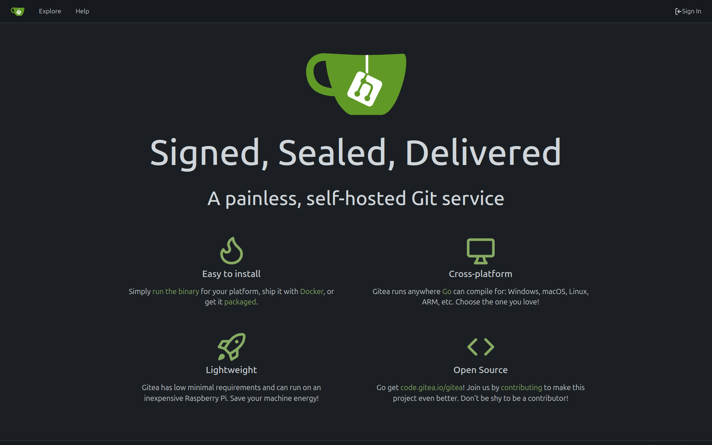

Puis en fouillant un peu on trouve deux pages intéressantes :

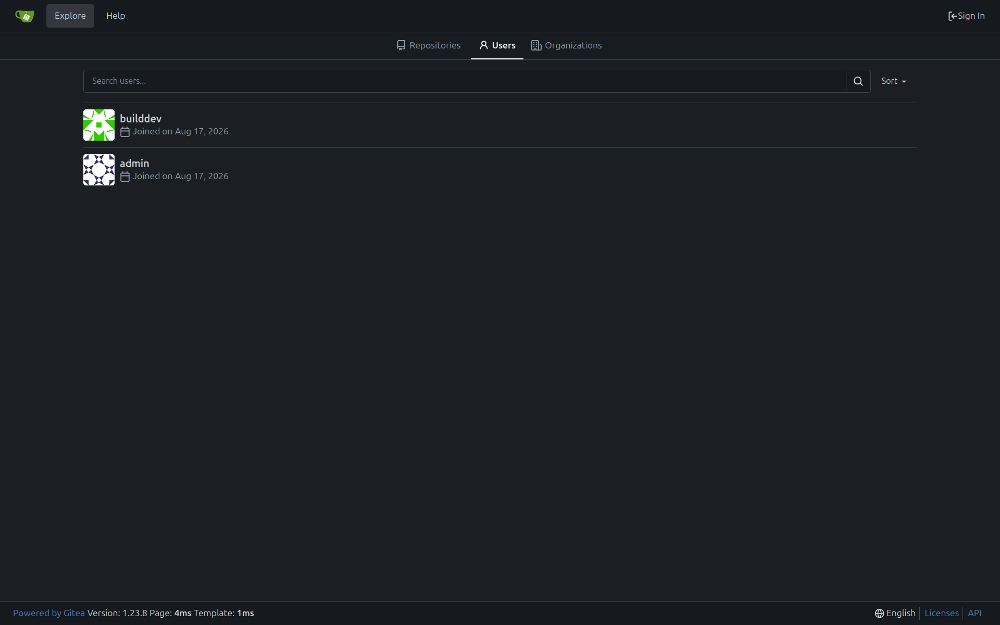

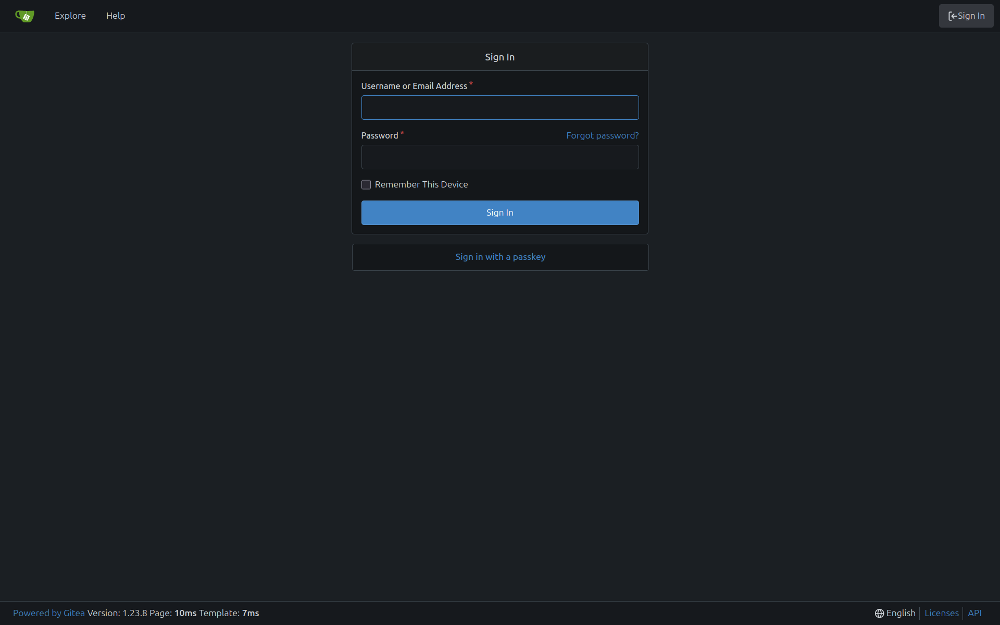

La première page nous permet de leak deux users :
- builddev
- admin

et la deuxième page nous permettra de nous connecter dès lors que l'on aura récupéré des creds valide.


Pour le moment, intéressons nous au terminal disponible à `https://[challenge-url]/shell/`

Les premières informations sont les suivantes:

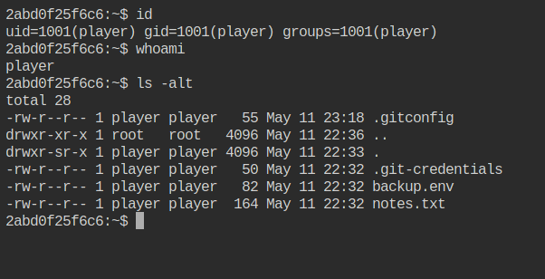


En refaisant le challenge je me suis rendu compte qu'il était possible de récupérer le flag bien plus rapidemment. Peu importe si cela était fait exprès par les créateurs du challenge, le hacking c'est aussi contourner les chemins "offciels". 

La méthode plus rapide sera décrite dans la section `Raccourci`.

Faisons comme si de rien n'était.

En fouillant dans les fichiers présent dans le répertoire courant. On trouve des creds du user `builddev` :


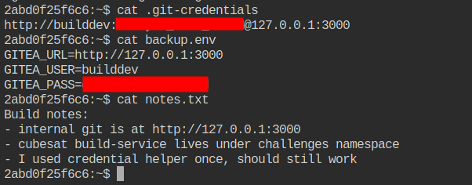

Nous en profitons directement pour se connecter à la plateforme Gitea

Immédiatement, nous voyons un repository nommé `build-service`

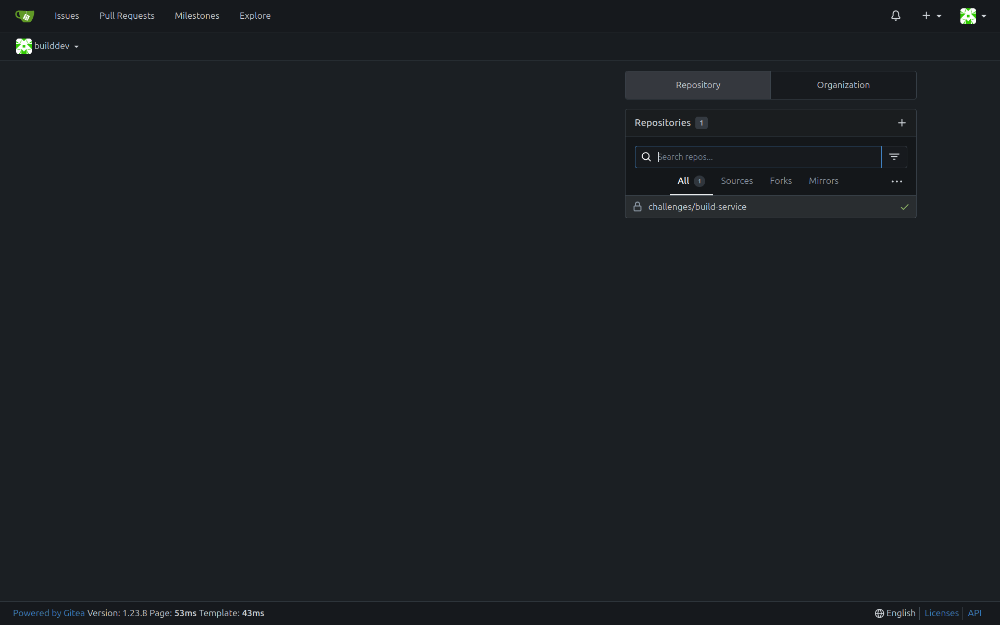

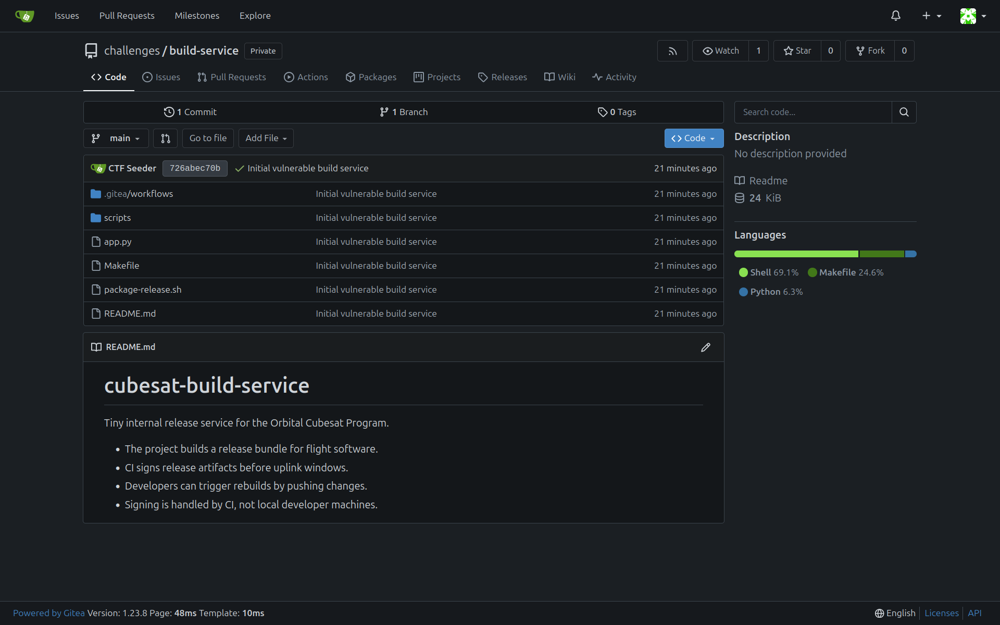

Les fichiers `app.py`, `Makefile` et `package-release.sh` ne contiennet rien d'intéressant. Le dossier `scripts` non plus. 

Il ne nous reste plus que le dossier `.gitea/workflow` qui contient le fichier principale de la pipeline CI/CD.

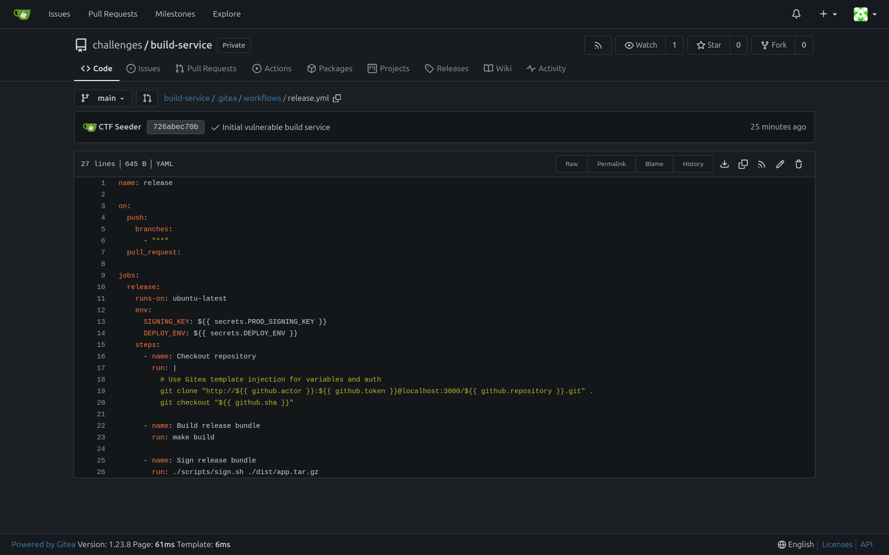

Immédiatement on peut remarquer la variable `SIGNING_KEY` qui charge le secret `PROD_SIGNING_KEY` qui est la clé qui nous interesse.

Pour comprendre ce que fait la pipeline, commençons par le bloc `on`.

Le bloc `on` est le bloc dan lequel on retrouve les conditions pour que la pipeline ce déclenche. Ici, elle se déclenche sous une des deux conditions suivantes:

un `push` sur n'importe quelle branche (caractérisé par `"**"` sous le cloc `branches`) ou bien une `pull_request` (pas de condition supplémentaire).

Ensuite le bloc `jobs` décrit les actions qui vont être réalisé si la pipeline se déclenche. On voit donc que des variables sont chargés puis une suite de commande `git` ainsi qu'un `make` et l'éxécution d'un script shell (on s'en fout un peu).

Etant donné qu'on sait qu'elle élément nous intéresse (`SIGNING_KEY`) il nous reste plus qu'a ruser pour récupérer le contenu.

Première idée: On va simplement afficher à l'aide de la commande `echo` la valeur de cette variable. Ainsi lors de l'éxécution de la pipeline, nous serons en mesure de voir son contenu dans les logs de la pipeline.

C'est parti !

1. On modifie la pipeline

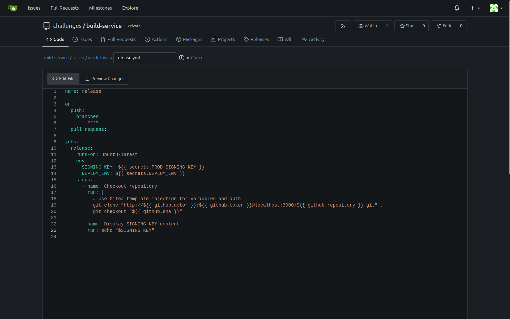

2. On crée une branche (afin de faire une PR ensuite et déclencher la pipeline)

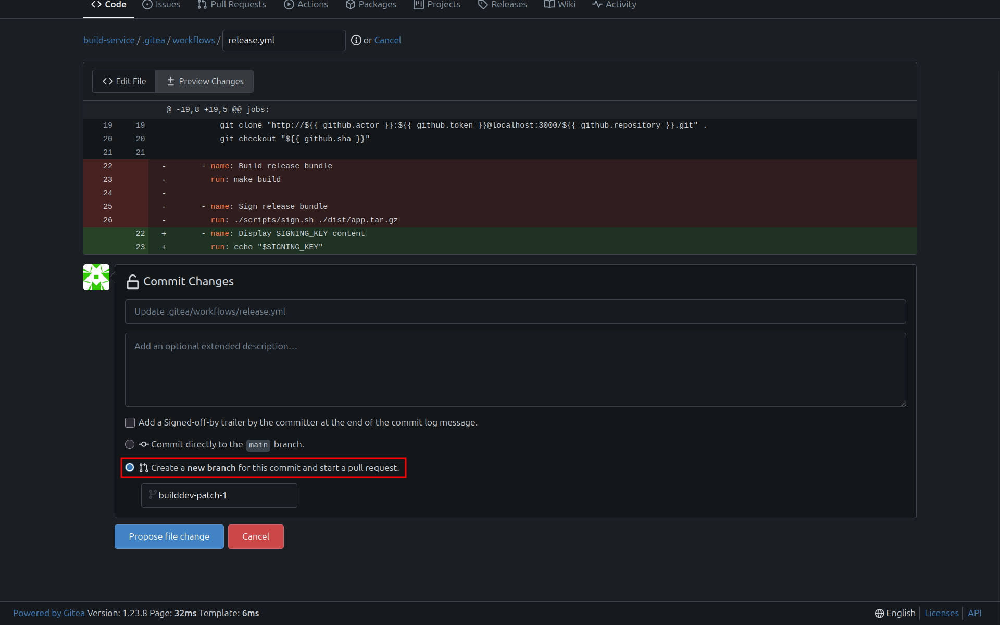

3. Puis on crée une PR

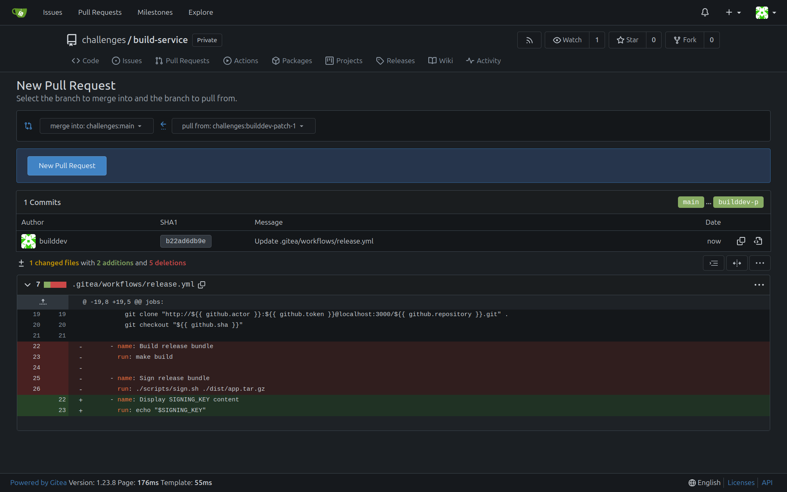

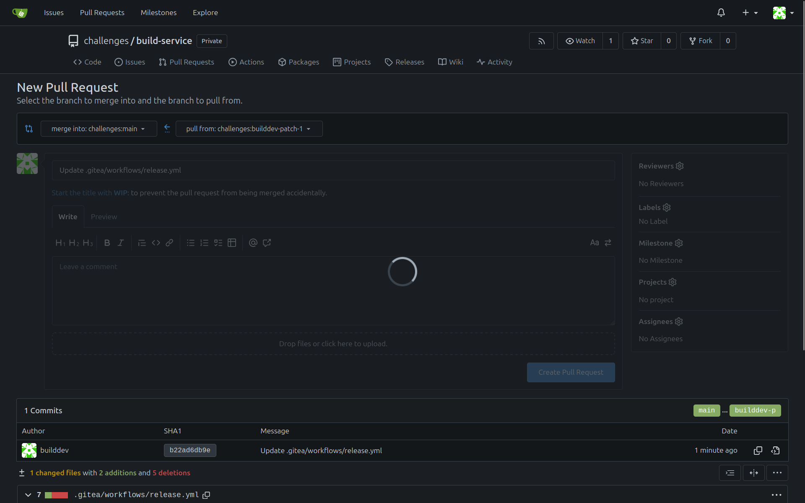

4. On check les logs de la pipeline

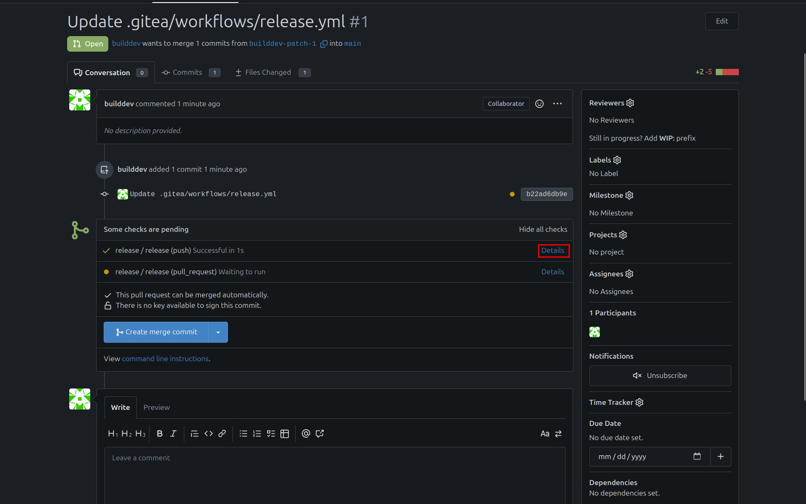

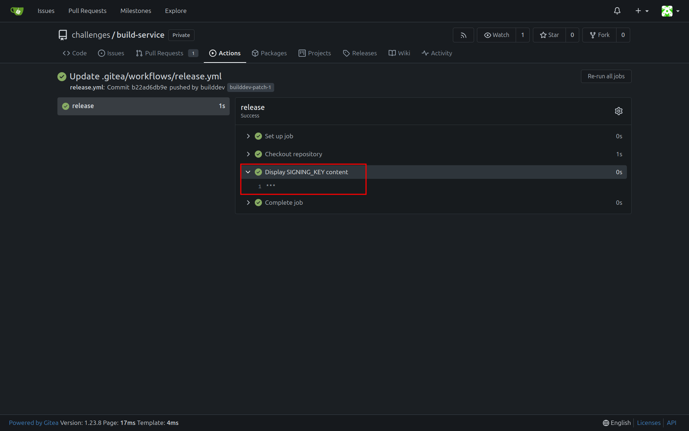

Malheuresement, l'output nous donne `***`. 

En faite cela est tout à fait normal, la pipeline n'affiche pas les variables qui proviennent du contexte `secrets.*` De la même manière il n'est pas possible d'afficher un fichier avec comme contenu la variable d'environnement. Il va donc falloir ruser un peu.

Je suis retourné sur le `/shell` pour intéragir avec le système et récupérer d'autres informations utiles.

Première chose que je voulais faire c'était énumérer les users sur la machine.

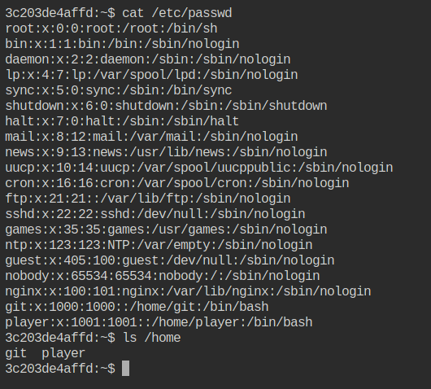

On trouve le user `git` (moyennement interessant tant qu'on a pas le mdp). 

On va tester la startégie suivante : 


- Créer un fichier `.txt` avec en contenu la variable d'environnement.
- Placer ce fichier dans le répertoire `/home/player` puis lire le fichier depuis le terminal.

Allons-y

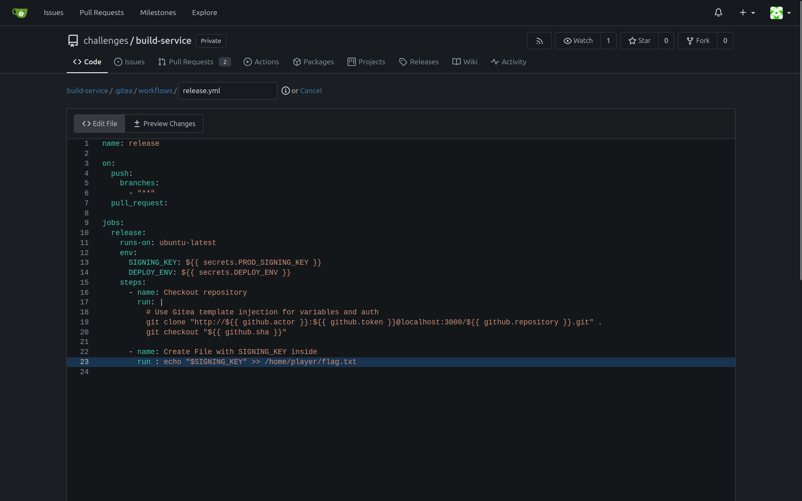

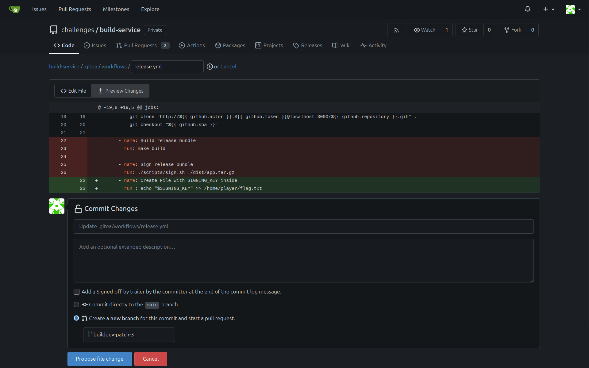


On lance la pipeline toujours grâce à la PR.

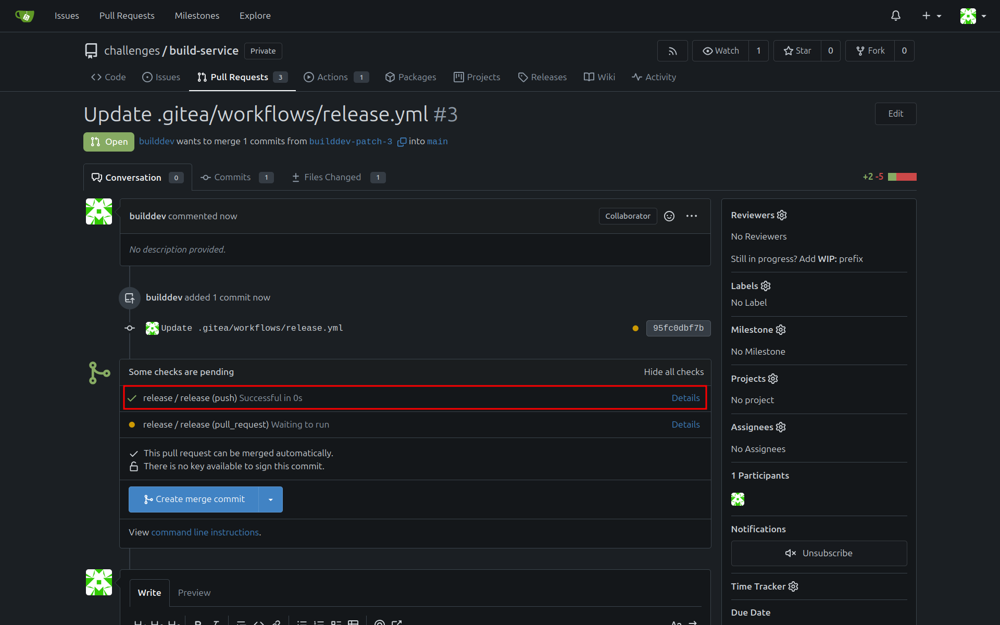


On se rend sur le terminal :

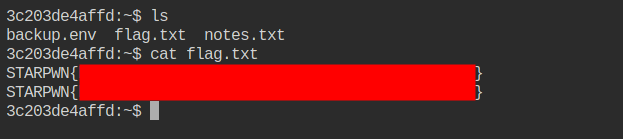

Et bingo ! 

On remarque que l'on a plusieurs fois le flag, c'est tout simplement parce que la pipeline s'est éxécuté plusieurs fois.


#### Raccourci

Ainsi partant de la première étape avec le terminal


Et en affichant les variables d'environnement :

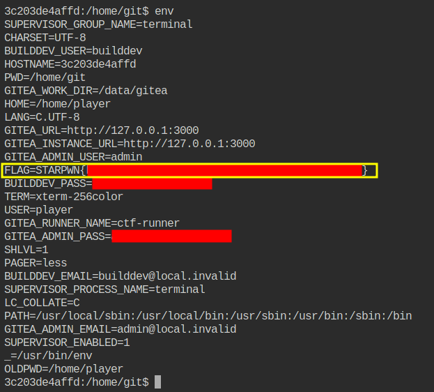

Voilà pourquoi j'ai utilisé l'expressions "bien plus rapidemment".


