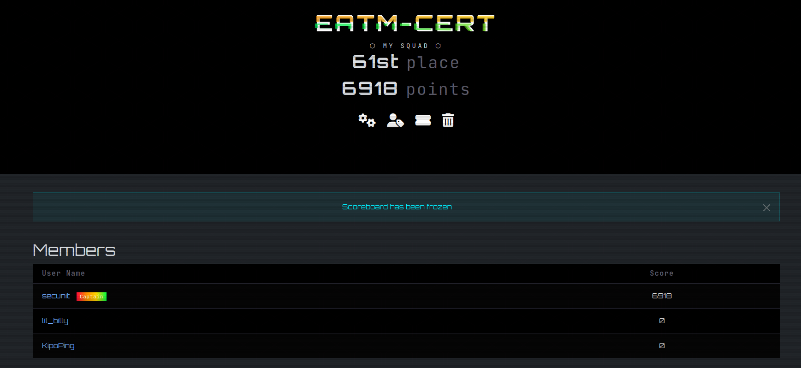

+++
title = "STARPWN2026"
date = 2026-08-17T14:42:11+02:00
draft = false

[menus.main]
  name = "STARPWN2026"
  weight = 30
  parent = "Compétitions"
+++

#### STARPWN c'est quoi ?

La compétition STARPWN est une compétition organisé par Aerospace Village.

Aerospace Village est une initiative communautaire à but non lucratif dédiée à la cybersécurité des secteurs de l'aviation et du spatial.

Elle est principalement connue comme l'un des « villages » thématiques majeurs de la conférence de hackers DEF CON à Las Vegas, mais elle intervient également lors d'autres événements majeurs (comme la RSA Conference).

Comme décrit sur leur site web (voir ci-dessous), les challenges s'articulent autour de la sécurité des satellites:

[Aerospace Village](https://www.aerospacevillage.org/general-9)

Le challenge s'annonçait difficile étant donné que je n'avais pas de connaissances particulière sur les satellites.

#### Résultat

STARPWN ne propose que des classements par équipes. J'ai joué sous les bannières de l'EATM-CERT. Malgré le fait que j'étais le seul joueur de mon équipe à participer, j'ai réussi à décrocher une belle 61ème place sur 330 équipes (score ci-dessous).

Je suis plutôt satifsait de ce résultat même si je pense que j'aurais pu clairement réussir quelques challenges de plus qui m'aurait offert une place dans le top 50 (voire top 40).

Dans tout les cas c'était une belle expérience et je pense sincèrement refaire ce challenge l'année prochaine.

Vous touverez ci-dessous les catégories des challenges proposées et dans chaque catégorie les write-up associé (pour ceux que j'au réussi à résoudre).

